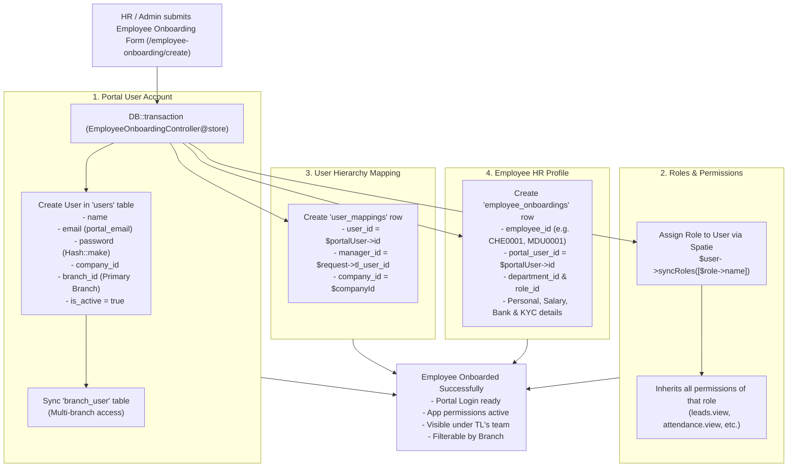

# Unified Employee Onboarding: Portal Account, Roles, Permissions & User Mapping Guide

> **Target Application:** MyAgency CRM & HRMS  
> **Primary Module:** Employee Onboarding (`/employee-onboarding`)  
> **Key Philosophy:** **Single-Entry Unified Lifecycle** — Replace separate user creation (`/users/create`) with the automated, all-in-one Employee Onboarding workflow.  
> **File Location:** `docs/EMPLOYEE_ONBOARDING_PORTAL_ROLES_AND_USER_MAPPING_DOCUMENTATION.md`  
> **Created:** October 2026

---

## 1. Why Separate User Creation (`/users/create`) is NOT Recommended

In standard systems, admins often create a user in `/users/create`, and then HR separately creates an employee in HRMS. In MyAgency CRM, **this creates serious data synchronization issues**:

| Problems with Separate `/users/create` | Solutions via Unified Employee Onboarding (`/employee-onboarding/create`) |
|---|---|
| **Branch Filter Bug:** Employee profile is created without proper `users.branch_id` or `employee_id` prefix, causing branch filtering to fail. | **Auto-Synced:** Automatically assigns `branch_id`, syncs `branch_user` pivot table, and generates `employee_id` with branch code prefix. |
| **Missing Reporting Manager:** Users created separately often miss `user_mappings` (no manager assigned), breaking team data visibility. | **Built-in TL Mapping:** Step 02 forces selection of a valid Reporting Manager / Team Lead, instantly populating `user_mappings`. |
| **Orphaned Accounts:** A portal user exists without employee salary, KYC, emergency contact, or documents. | **Atomic HR Profile:** All 10 onboarding steps (KYC, Salary, Bank, Documents, Portal Login) are saved in a single database transaction. |
| **Manual Role Double-Handling:** Role has to be assigned in `/users`, then department chosen in HRMS. | **Dynamic Role Filter:** Selecting Department automatically filters roles mapped to that department. |

---

## 2. Architecture & Data Flow Diagram

When an employee is onboarded, the system runs an **atomic database transaction** (`DB::transaction`) that links 6 key components together:



---

## 3. Pre-Requisite Setup: Roles & Permissions Configuration

Before onboarding employees, your organization's Roles and Permissions must be configured **once** in the Auth/Settings menu.

### Step 1: Create or Verify Roles (`/roles`)
1. Navigate to **Settings > Roles** (`/roles`).
2. Click **"Create Role"** (`/roles/create`).
3. Fill in:
   - **Role Key:** Machine name (e.g., `tele_caller`, `bde`, `senior_dev`, `branch_manager`).
   - **Display Name:** Friendly name (e.g., `Tele Caller`, `Business Development Executive`).
   - **Department:** Link the role to its department (e.g., `Sales`, `HR`, `Production`).
4. Save the Role.

### Step 2: Assign Permissions to the Role (`/roles/{role}/permissions`)
1. From the Roles list, click the **Permissions icon** next to the role.
2. Check the required permissions:
   - For **Sales Executive:** Check `leads.view`, `leads.create`, `leads.edit`, `quotations.view`, etc.
   - For **Team Lead:** Check `leads.view`, `leads.assign`, `leads.reallocate`, `attendance.view`, etc.
3. Click **"Update Permissions"**.

### Step 3: Set Role Access Level in Role Mappings (`/role-mappings`)
1. Navigate to **Auth Menu > Role Mappings** (`/role-mappings`).
2. For each role, configure:
   - **Access Level:**
     - Executives / Telecallers: Set to `Assigned Self Data` (`self`).
     - Team Leads / Managers: Set to `Mapped Team Data` (`team`).
     - Directors / CBO / COO: Set to `Company All Data` (`company`).
   - **Parent Role:** Select the superior role (e.g., Sales Executive's parent role is `Team Lead`). This powers the dynamic TL dropdown during onboarding!
3. Click **"Save Role Mapping"**.

---

## 4. The Unified Employee Onboarding Walkthrough

When hiring a new staff member, follow this single, unified process:

### Navigate to:
**HRMS > Employee Onboarding > Add Employee** (`/employee-onboarding/create`)

---

### Step 01: Personal Details
Capture basic personal identity:
* **Full Name & Mobile:** Required for identification.
* **Email ID:** Personal email address (automatically mirrored into portal login email).
* **Date of Birth & Joining Date:** For HR records and probation tracking.
* **Aadhaar & PAN Number:** Statutory verification.
* **Status:** Select `Active`.
* **Employee Type:** Billable vs Non-Billable.

---

### Step 02: Employee Portal Account (The Core Integration Step)
This is where the user login, branch mapping, role assignment, and reporting hierarchy are configured:

```
+-----------------------------------------------------------------------------------+
| STEP 02: EMPLOYEE PORTAL ACCOUNT                                                  |
+-----------------------------------------------------------------------------------+
| [1] User Email:        [ employee@agency.com                           ]          |
|     (Auto-filled from personal email, can be edited to company email)             |
|                                                                                   |
| [2] Password:          [ ****************                              ]          |
|     (Initial password for portal login, minimum 8 characters)                     |
|                                                                                   |
| [3] Branch:            [ Chennai Branch (CHE)                        v ]          |
|     (Primary branch - generates CHE0001 employee ID automatically)                |
|                                                                                   |
| [4] Additional Branches: [ ] Madurai   [x] Coimbatore   [ ] Bangalore             |
|     (Optional multi-branch access for area managers / regional leads)             |
|                                                                                   |
| [5] Department:        [ Sales & Marketing                           v ]          |
|     (Filtering department activates only relevant roles below)                    |
|                                                                                   |
| [6] Role:              [ Sales Executive                             v ]          |
|     (Selects Spatie role - instantly attaches all permissions)                    |
|                                                                                   |
| [7] TL Mapping:        [ Suresh Kumar (Sales Team Lead - CHE)        v ]          |
|     (Intelligently filtered by branch, department, and parent role!)              |
+-----------------------------------------------------------------------------------+
```

#### Detailed Breakdown of Step 02 Fields:

1. **User Email (`portal_email`):**
   - Automatically copied from the Personal Details step.
   - This becomes `users.email` in the database.

2. **Password (`portal_password`):**
   - Hashed using `Hash::make()` and stored in `users.password`.

3. **Branch (`branch_id`):**
   - Sets the primary `users.branch_id`.
   - **Auto-generates Employee ID:** An AJAX call (`/employee-onboarding/generate-id?branch_id=XX`) fetches the branch code (e.g. `CHE`) and finds the next sequence number (e.g. `CHE0004`).

4. **Additional Branches (`branches[]`):**
   - Stored in the `branch_user` pivot table. Allows regional TLs or cross-branch executives to access multiple branch databases without duplicate accounts.

5. **Department (`department_id`):**
   - When chosen, the client-side JavaScript (`filterRolesByDepartment()`) automatically hides roles belonging to other departments.

6. **Role (`role_id`):**
   - When selected, the user will be granted this role via Spatie (`$portalUser->syncRoles([$role->name])`).
   - The role's parent role metadata is evaluated to filter eligible Team Leads in the next field.

7. **TL Mapping (`tl_user_id`):**
   - Dynamically filtered to show active Team Leads matching:
     - The same Branch
     - The same Department
     - The mapped Parent Role (e.g. If role is `Sales Executive`, parent role is `Team Lead`, so only Team Leads appear)
     - Super Admins / Company Admins are always available as fallback.
   - Selecting the TL automatically creates the row in `user_mappings`.

---

### Steps 03 to 10: Complete the Onboarding Wizard
* **Step 03 - Emergency Contact:** Relative name, relationship, and contact number.
* **Step 04 - Education Details:** Dynamic rows for 10th, 12th, UG, PG.
* **Step 05 - Employment Details:** Previous experience, organizations, and past CTC.
* **Step 06 - Family Details:** Immediate dependents.
* **Step 07 - Professional References:** Past manager reference details.
* **Step 08 - Employee Salaries:** Gross salary, Basic (50%), HRA (30%), PF & ESI statutory deductions, Professional Tax, Net Salary.
* **Step 09 - Bank Details:** Bank name, Account number, IFSC code, and Branch.
* **Step 10 - Document Uploads:** Photographs, Certificates, Aadhaar card, PAN card, Relieving letters.

Click **"Submit Employee Onboarding"** to finalize.

---

## 5. Technical Execution: What Happens in the Backend

When the form is submitted to `POST /employee-onboarding` (`EmployeeOnboardingController@store`), the following atomic transaction executes:

```php
$employee = DB::transaction(function () use ($request, $validated) {
    // 1. Sync & Create Portal User Account
    $portalUser = $this->syncPortalAccount(null, $validated);

    // 2. Instantiate and fill Employee Record
    $employee = new EmployeeOnboarding();
    $employee->fill($this->extractAttributes($validated));
    
    // 3. Generate Branch-aware Employee ID (e.g. CHE0005)
    $employee->employee_id = $this->generateNextEmployeeId($validated['branch_id'] ?? null);
    
    // 4. Link User ID to Employee Record
    $employee->portal_user_id = $portalUser->id;
    $employee->created_by = auth()->id();
    $employee->updated_by = auth()->id();
    
    // 5. Save Files & Employee Profile
    $this->fillFileAttributes($employee, $request);
    $employee->save();

    // 6. Save Education, Employment, Family Details
    $this->syncRelatedRows($employee, $validated);

    // 7. Sync Reporting Manager / TL Mapping
    $this->syncPortalMapping($portalUser, $validated);

    return $employee;
});
```

### Breakdown of Helper Methods:

#### 1. `syncPortalAccount()`:
```php
$attributes = [
    'name'        => $validated['name'],
    'email'       => $validated['portal_email'],
    'branch_id'   => $validated['branch_id'] ?: null,
    'company_id'  => auth()->user()?->company_id,
    'is_active'   => ($validated['status'] === EmployeeOnboarding::STATUS_ACTIVE),
    'password'    => Hash::make($validated['portal_password']),
];

$user = User::create($attributes);

// Assign Role via Spatie
if ($role) {
    $user->syncRoles([$role->name]);
}

// Sync Multi-Branches
if (array_key_exists('branches', $validated)) {
    $user->branches()->sync($validated['branches'] ?? []);
}
```

#### 2. `syncPortalMapping()`:
```php
if (!empty($validated['tl_user_id'])) {
    UserMapping::withoutGlobalScopes()->updateOrCreate(
        ['user_id' => $user->id],
        [
            'manager_id' => $validated['tl_user_id'],
            'company_id' => $user->company_id ?: auth()->user()?->company_id,
        ]
    );
}
```

---

## 6. How the System Behaves After Onboarding

Once onboarded via this flow:

### 1. For the Employee:
* Can immediately log into the web portal or mobile app using `portal_email` and `portal_password`.
* Automatically has permissions matching their role (e.g. can create leads, request leave, punch attendance).
* Data Visibility: If their role is `self`, they only see their assigned leads and tasks.

### 2. For the Team Lead (TL):
* Because `user_mappings` was populated with `manager_id = $tl->id`, the Team Lead:
  - Immediately sees this new employee's name in their team attendance dashboard.
  - Can view and reallocate leads assigned to this employee.
  - Can approve leave and OD requests for this employee.

### 3. For the Branch Admin:
* The employee's `users.branch_id` matches the branch, and `employee_id` starts with the branch code (e.g. `CHE0001`).
* When filtering by **Branch** in the Employee Onboarding table, Attendance, or User lists, **this employee displays accurately without getting lost!**

---

## 7. How to Update Role, Branch, or Reporting Manager Later

If an employee gets promoted, transferred to a new branch, or reports to a new Team Lead:

1. Go to **HRMS > Employee Onboarding** (`/employee-onboarding`).
2. Click **"Edit"** next to the employee (`/employee-onboarding/{id}/edit`).
3. Click on **Step 02: Employee Portal Account**.
4. Update the desired field:
   - **Branch changed?** Select new branch (auto-updates `users.branch_id`).
   - **Promoted to new Role?** Select new role (auto-syncs Spatie roles and permissions).
   - **New Reporting Manager?** Select new TL (auto-updates `user_mappings`).
   - **Password reset?** Enter a new password or leave blank to keep unchanged.
5. Click **"Save"**. The system updates both the employee profile and user mapping synchronously!

---

## 8. Summary in Tanglish (சுருக்கம்)

| கேள்வி | விளக்கம் |
|---|---|
| **தனியாக User Create பண்ணனுமா?** | **தேவையில்லை.** Separate User creation (`/users/create`) பண்ணினால் Branch link, TL mapping விடுபட வாய்ப்புள்ளது. |
| **Employee Onboarding மூலமாக என்ன நடக்கும்?** | **Step 01**-ல் Personal Details, **Step 02**-ல் Portal Email, Password, Branch, Role, மற்றும் TL Mapping கொடுத்தால் போதும். |
| **Portal Account எப்படி உருவாகும்?** | Form submit ஆனதும் `syncPortalAccount()` தானாகவே `users` table-ல் password-ஐ hash செய்து account create பண்ணிவிடும். |
| **Role & Permissions எப்படி assign ஆகும்?** | நீங்கள் தேர்ந்தெடுக்கும் Role (`role_id`), Spatie-ன் `$user->syncRoles()` மூலம் User-க்கு attach ஆகி, அந்த Role-ல் உள்ள அனைத்து Permissions-உம் உடனே வேலை செய்யும். |
| **User Mapping (TL) எப்படி நடக்கும்?** | Step 02-ல் தேர்ந்தெடுக்கும் `tl_user_id`, தானாகவே `user_mappings` table-ல் `manager_id -> user_id` என்று map ஆகிவிடும். இதனால் Team Lead-ன் dashboard-ல் இந்த employee உடனே தெரிவார். |
| **Branch Filter பிரச்சினை ஏன் வராது?** | Branch select பண்ணும்போது `users.branch_id` செட் ஆவதுடன், `employee_id`-யும் Branch Code-உடன் (e.g. `CHE0001`) உருவாவதால் Branch filtering 100% சரியாக வேலை செய்யும். |
