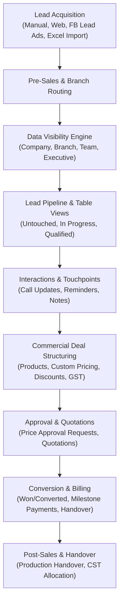
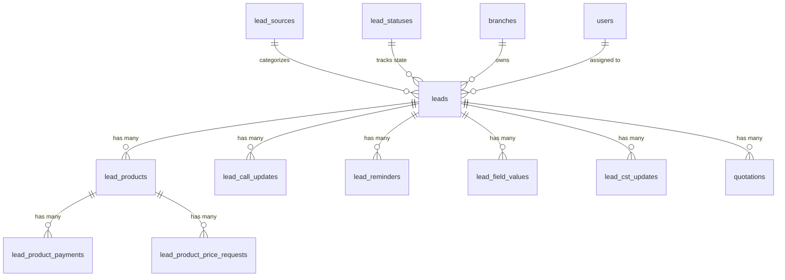
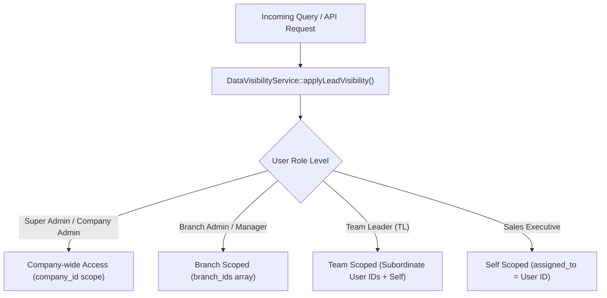

# Lead Module Technical Architecture & Development Documentation
**Platform:** myAgenci.ai CRM  
**Module:** Lead Management & Sales Pipeline  
**Version:** 2.0  
**Stack:** Laravel 11 / PHP 8.2+, MySQL 8.0, Blade, jQuery / Select2, RESTful API (Sanctum)

---

## 1. Executive Summary & Architectural Overview

The **Lead Module** is the foundational CRM engine of `myAgenci.ai`. It orchestrates the entire lifecycle of prospects—from lead generation (via web forms, manual creation, CSV imports, and automated Facebook Lead Ads Graph API sync) through qualification, call tracking, product mapping, quotation building, and conversion into paying clients.



### Architectural Highlights
- **Multi-Tenant Isolation:** Built on the `BelongsToCompany` trait, enforcing strict company-level tenant boundaries.
- **Hierarchical Data Visibility:** Scoped dynamically via `DataVisibilityService` across Company Admin, Branch Manager, Team Leader (TL), and Individual Sales Executive levels.
- **Dynamic Field Engine:** Supports extensible custom fields (`LeadFormField` & `LeadFieldValue`) per branch and tenant without database schema alterations.
- **Multi-Product Line Items:** Supports multiple products/services per lead with custom pricing, discount approval workflows, and milestone payment tracking.
- **Omni-Channel Synchronization:** Unified web dashboard paired with Sanctum-authenticated mobile REST API endpoints for Android/iOS apps.

---

## 2. Database Schema & Data Dictionary

The module revolves around the central `leads` table and multiple satellite operational tables:



### 2.1. `leads` Table (Core Entity)
Stores high-level business profile, contact details, ownership, and current state.

| Column | Type | Nullable | Description |
|---|---|---|---|
| `id` | `BIGINT UNSIGNED` | No | Auto-increment Primary Key |
| `company_id` | `BIGINT UNSIGNED` | Yes | Multi-tenant tenant ID (`companies.id`) |
| `branch_id` | `BIGINT UNSIGNED` | No | Branch ownership (`branches.id`) |
| `company_name` | `VARCHAR(150)` | No | Lead organization / business name |
| `contact_name` | `VARCHAR(100)` | No | Primary contact person name |
| `lead_date` | `DATE` | No | Inbound lead arrival date |
| `mobile_number` | `VARCHAR(20)` | No | Primary phone (E.164 compliant: `/^\+?[0-9]{7,15}$/`) |
| `email` | `VARCHAR(150)` | Yes | Contact email address |
| `lead_source_id` | `BIGINT UNSIGNED` | Yes | Foreign Key to `lead_sources.id` |
| `lead_source` | `VARCHAR(255)` | Yes | Legacy source name cache/fallback |
| `lead_status_id` | `BIGINT UNSIGNED` | Yes | Foreign Key to `lead_statuses.id` |
| `lead_status` | `VARCHAR(255)` | Yes | Legacy status string fallback (e.g. `new`, `qualified`) |
| `priority` | `ENUM` | No | `low`, `medium`, `high` (Default: `medium`) |
| `deal_value` | `DECIMAL(12,2)` | Yes | Estimated high-level pipeline opportunity value |
| `remarks` | `TEXT` | Yes | Initial notes / lead requirements |
| `assigned_to` | `BIGINT UNSIGNED` | Yes | Sales Executive user (`users.id`) |
| `pre_sale_executive_id` | `BIGINT UNSIGNED` | Yes | Pre-sales qualifier user (`users.id`) |
| `customer_support_tl_id` | `BIGINT UNSIGNED` | Yes | Allocated Customer Support TL (`users.id`) |
| `customer_support_executive_id`| `BIGINT UNSIGNED` | Yes | Allocated CST Support Executive (`users.id`) |
| `customer_support_allocated_at`| `DATETIME` | Yes | Timestamp of CST allocation |
| `created_by` | `BIGINT UNSIGNED` | Yes | User who captured the lead |
| `facebook_lead_id` | `VARCHAR(255)` | Yes | Facebook Graph API Lead ID (if synced via webhook/API) |
| `facebook_campaign_id` | `VARCHAR(255)` | Yes | Facebook Ad Campaign ID |
| `facebook_payload` | `JSON` | Yes | Raw JSON payload from Meta Lead Ads |
| `product_id` | `BIGINT UNSIGNED` | Yes | Primary product interest ID (`products.id`) |
| `product_name` | `VARCHAR(255)` | Yes | Cached primary product name |
| `created_at` / `updated_at` | `TIMESTAMP` | Yes | Timestamps |
| `deleted_at` | `TIMESTAMP` | Yes | Soft delete tracking |

---

### 2.2. `lead_products` Table (Line Items)
Maps specific products/services to a lead, tracking itemized pricing, sales discounts, GST, and conversion status.

| Column | Type | Description |
|---|---|---|
| `id` | `BIGINT UNSIGNED` | Primary Key |
| `lead_id` | `BIGINT UNSIGNED` | FK to `leads.id` (Cascade delete) |
| `product_id` | `BIGINT UNSIGNED` | FK to `products.id` |
| `product_name` | `VARCHAR(255)` | Service / Product item title |
| `deal_name` | `VARCHAR(255)` | Specific deal title or package customization |
| `unit_price` | `DECIMAL(12,2)` | Base unit rate |
| `quantity` | `INT` | Quantity units |
| `discount_percent` | `DECIMAL(5,2)` | Applied discount % |
| `gst_percent` | `DECIMAL(5,2)` | Applied GST % (e.g. 18.00) |
| `total_price` | `DECIMAL(12,2)` | Net payable price after discount and taxes |
| `amount_paid` | `DECIMAL(12,2)` | Total advance/realized collections to date |
| `payment_status` | `VARCHAR(50)` | `pending`, `partial`, `paid` |
| `product_status` | `VARCHAR(100)` | Line item status (`in_progress`, `won`, `lost`, etc.) |
| `lead_status_id` | `BIGINT UNSIGNED` | Independent status stage for this product line |
| `converted_at` | `DATETIME` | Exact timestamp when product line closed as Won |
| `closure_date` | `DATE` | Expected or realized sale closure date |

---

### 2.3. `lead_call_updates` Table (Telephony & Interaction Logs)
Logs every conversation, outcome category, tele-caller notes, and next follow-up dates.

| Column | Type | Description |
|---|---|---|
| `id` | `BIGINT UNSIGNED` | Primary Key |
| `lead_id` | `BIGINT UNSIGNED` | FK to `leads.id` |
| `user_id` | `BIGINT UNSIGNED` | Caller executive ID (`users.id`) |
| `called_at` | `DATETIME` | Call timestamp |
| `outcome` | `VARCHAR(100)` | Master outcome ID / category |
| `outcome_subcategory` | `VARCHAR(100)` | Subcategory outcome ID (e.g., "Price Objection") |
| `notes` | `TEXT` | Conversation transcript / caller notes |
| `next_follow_up` | `DATE` | Scheduled follow-up date |
| `followup_time` | `TIME` | Scheduled follow-up time slot |

---

### 2.4. `lead_reminders` Table (Tasks & Follow-up Notifications)
Automatically generated whenever a call log includes a future follow-up date, or scheduled manually.

| Column | Type | Description |
|---|---|---|
| `id` | `BIGINT UNSIGNED` | Primary Key |
| `lead_id` | `BIGINT UNSIGNED` | FK to `leads.id` |
| `user_id` | `BIGINT UNSIGNED` | Assigned agent to execute the reminder |
| `title` | `VARCHAR(255)` | Reminder title (e.g. "Follow-up Call: Proposal Review") |
| `description` | `TEXT` | Notes and briefing |
| `remind_at` | `DATE` | Scheduled execution date |
| `remainder_time` | `TIME` | Execution time |
| `is_completed` | `BOOLEAN` | `1` when completed, `0` when pending |
| `completed_at` | `DATETIME` | Completion timestamp |

---

### 2.5. `lead_product_payments` Table (Collections & TDS Tracking)
Detailed transaction receipts collected against specific lead product lines.

| Column | Type | Description |
|---|---|---|
| `id` | `BIGINT UNSIGNED` | Primary Key |
| `lead_id` | `BIGINT UNSIGNED` | FK to `leads.id` |
| `lead_product_id` | `BIGINT UNSIGNED` | FK to `lead_products.id` |
| `amount` | `DECIMAL(12,2)` | Gross payment received |
| `is_tds_deducted` | `BOOLEAN` | Indicates if TDS was withheld by client |
| `tds_percentage` | `DECIMAL(5,2)` | TDS % deducted |
| `tds_amount` | `DECIMAL(12,2)` | TDS amount deducted |
| `after_tds_amount` | `DECIMAL(12,2)` | Net bank credit received |
| `payment_mode` | `VARCHAR(50)` | `NEFT`, `UPI`, `Cheque`, `Card`, `Cash` |
| `payment_date` | `DATE` | Bank credit / transaction date |
| `reference_number`| `VARCHAR(100)` | Bank UTR / Cheque / Transaction reference |
| `attachment_path` | `VARCHAR(255)` | Bank receipt file voucher attachment |

---

### 2.6. `lead_form_fields` & `lead_field_values` (Dynamic Custom Fields)
Allows tenant admins to configure custom fields (e.g. "GST Number", "Annual Turnover", "Website URL", "Branch Specific Dropdowns") without running database migrations.

- `lead_form_fields`: Contains `field_name`, `label`, `field_type` (`text`, `number`, `email`, `select`, `radio`, `file`, `date`), `options` (JSON), `is_required`, `show_on_lead_create`, `validation_rules`.
- `lead_field_values`: Entity-Attribute-Value (EAV) storage mapping `lead_id` + `lead_form_field_id` to `value`.

---

## 3. Eloquent Models & Business Logic

### 3.1. `App\Models\Lead`
The central model incorporates global scopes, automated lifecycle hooks, and convenience helpers.

#### Lifecycle Hooks (`booted()`)
```php
protected static function booted(): void
{
    // Global Branch Scoping for Branch Managers
    static::addGlobalScope('branch', function (Builder $builder) {
        if (! auth()->hasUser()) return;
        $user = auth()->user();
        if ($user && $user->isBranchAdmin()) {
            $branchIds = $user->getMyBranchIds();
            if (!empty($branchIds)) {
                $builder->whereIn($builder->getModel()->getTable() . '.branch_id', $branchIds);
            }
        }
    });

    // Auto-assignment during creation
    static::creating(function (Lead $lead) {
        if (!$lead->created_by && auth()->check()) {
            $lead->created_by = auth()->id();
        }
        if (!$lead->company_id && auth()->check()) {
            $lead->company_id = auth()->user()?->company_id;
        }
        if (!$lead->lead_date) {
            $lead->lead_date = now()->toDateString();
        }
    });
}
```

#### Key Scopes
- `scopeForUser($query, $userId)`: Restricts records to where `assigned_to == $userId` or `created_by == $userId`.
- `scopeForBranch($query, $branchId)`: Limits records to a specific branch.
- `scopeConverted($query)`: Matches won leads using status IDs `[5, 15]` or status strings `won` / `converted`, also checking line items in `lead_products`.
- `scopeLost($query)`: Filters lost / cancelled / not-interested leads.

---

## 4. Security & Role-Based Data Visibility (`DataVisibilityService`)

Visibility in the Lead Module is managed centrally by [`App\Services\DataVisibilityService`](app/Services/DataVisibilityService.php). Rather than hardcoding queries in controllers, `applyLeadVisibility($query)` is called to scope database queries dynamically:



### Access Level Definitions:
1. **`ACCESS_COMPANY` (Company Admins / Directors):** Can view and manage all leads across all branches belonging to their `company_id`.
2. **`ACCESS_BRANCH` (Branch Managers):** Restricted to leads belonging to their assigned branch IDs via `user_branches`.
3. **`ACCESS_TEAM` / `ACCESS_TL` (Team Leaders):** Can view leads assigned to themselves and any executives mapped under their reporting hierarchy in `user_mappings`.
4. **`ACCESS_SELF` (Telecallers / Sales Executives):** Strictly restricted to leads where `assigned_to = auth()->id()` or `created_by = auth()->id()`.

---

## 5. Web & Mobile API Endpoints

### 5.1. Web Routes (`routes/web.php`)

All web routes are prefixed with `/leads` and protected by permission middlewares:

| Method | Endpoint | Action / Controller | Middleware | Description |
|---|---|---|---|---|
| `GET` | `/leads` | `LeadController@index` | `can:leads.view` | Main Lead Pipeline & Table with extensive filters |
| `GET` | `/leads/untouched` | `LeadController@untouchedIndex` | `can:leads.view` | Leads with 0 call updates (fresh/uncalled) |
| `GET` | `/leads/products` | `LeadController@productsIndex` | `can:leads.view` | Leads Product items breakdown view |
| `GET` | `/leads/create` | `LeadController@create` | `can:leads.create` | Lead creation form |
| `POST` | `/leads` | `LeadController@store` | `can:leads.create` | Save new lead & dynamic custom fields |
| `GET` | `/leads/{lead}` | `LeadController@show` | `can:leads.view` | 360-degree lead profile page |
| `GET` | `/leads/{lead}/edit` | `LeadController@edit` | `can:leads.edit` | Lead edit form |
| `PUT` | `/leads/{lead}` | `LeadController@update` | `can:leads.edit` | Update lead attributes |
| `DELETE` | `/leads/{lead}` | `LeadController@destroy` | `can:leads.delete` | Soft-delete lead |
| `PATCH` | `/leads/{lead}/status` | `LeadController@updateStatus` | `can:leads.update` | Quick status change |
| `POST` | `/leads/{lead}/reassign` | `LeadController@reassign` | `auth` | Reallocate lead to another agent |
| `POST` | `/leads/{lead}/calls` | `LeadShowController@storeCall` | `can:call_updates.create` | Log call update and auto-create reminder |
| `POST` | `/leads/{lead}/products` | `LeadShowController@storeProduct` | `can:leads.edit` | Attach product line item |
| `POST` | `/leads/{lead}/products/{p}/payments` | `LeadShowController@storeProductPayment` | `can:leads.edit` | Record payment against product line item |
| `POST` | `/leads/{lead}/cst-updates` | `LeadController@storeCstUpdate` | `auth` | Customer Support Team log update |

---

### 5.2. Mobile REST API Routes (`routes/api.php`)

Protected by `auth:sanctum`. Utilized by the Flutter mobile CRM applications:

- `GET /api/leads` - Paginated leads list with mobile filter parameters.
- `GET /api/leads/{id}` - Complete lead JSON resource including products, calls, and reminders.
- `POST /api/leads` - Mobile lead capture (validates via `Lead::MOBILE_NUMBER_REGEX`).
- `PUT /api/leads/{id}` - Update lead profile.
- `PATCH /api/leads/{id}/status` - Quick stage change.
- `GET /api/leads/employees-search` - Search agents for reassignment.
- `GET /api/leads/search` - Lightweight search by contact name, company name, or phone.
- `POST /api/leads/{id}/calls` - Log mobile call update.
- `GET /api/leads/price-requests` - Fetch pending discount approval requests.
- `POST /api/leads/price-requests/{id}/approve` - Approve price reduction.
- `POST /api/leads/price-requests/{id}/reject` - Reject price reduction.

---

## 6. Core Subsystems & Integrations

### 6.1. Untouched Leads Pipeline
Leads that arrive in the system but have not received any interaction are monitored on `/leads/untouched`. A lead is considered untouched if:
```sql
SELECT * FROM leads 
WHERE id NOT IN (SELECT DISTINCT lead_id FROM lead_call_updates)
  AND lead_status NOT IN ('won', 'lost', 'cancelled')
ORDER BY lead_date DESC;
```
This enables sales supervisors to prevent leads from growing cold and reallocate dormant leads.

---

### 6.2. Facebook Lead Ads Auto-Import
Integrated via [`App\Services\FacebookLeadImporter`](app/Services/FacebookLeadImporter.php):
- Connects to Meta Graph API `v19.0` using access tokens stored in `campaign_masters`.
- Polls or listens to webhook payloads containing `field_data` (`full_name`, `phone_number`, `email`, `city`).
- Maps Facebook form fields to internal CRM fields via `campaign_field_migrations`.
- Auto-assigns leads round-robin to active sales reps configured in `assigned_users`.
- Run automatically via background scheduler: `php artisan app:facebook-lead-integration`.

---

### 6.3. CSV / Excel Bulk Lead Import
Managed by [`App\Http\Controllers\LeadImportController`](app/Http/Controllers/LeadImportController.php):
1. **Upload & Parse:** Uploads `.csv` or `.xlsx` files and reads headers.
2. **Column Mapping:** Allows the administrator to map CSV headers to internal lead attributes (`Contact Person`, `Company Name`, `Mobile Number`, `Branch`, `Source`).
3. **Validation & Batch Ingestion:** Checks for mobile number duplicates, validates branch IDs, and bulk-inserts records in database transactions while respecting tenant isolation.

---

### 6.4. Price Request Approval Workflow
When a sales executive needs to offer a price below the product unit rate:
1. Executive requests a custom rate via `LeadProductPriceRequestController`.
2. A record is created in `lead_product_price_requests` with status `pending`.
3. Authorized managers (Super Admin / Company Admin / Sales Head) receive notification.
4. Upon approval (`status = 'approved'`), the `lead_products.unit_price` is updated, recalculating GST and totals automatically.

---

## 7. Developer & Extension Guidelines

### 7.1. Adding a New Field to the `leads` Table
When adding a permanent native column to `leads`:
1. **Create Migration:**
   ```bash
   php artisan make:migration add_new_field_to_leads_table --table=leads
   ```
2. **Update Fillable:** Add the column name to `$fillable` in [`App\Models\Lead`](app/Models/Lead.php).
3. **Update Requests:** Add validation rules in [`StoreLeadRequest.php`](app/Http/Requests/StoreLeadRequest.php) and [`UpdateLeadRequest.php`](app/Http/Requests/UpdateLeadRequest.php).
4. **Update Views:** Update [`resources/views/pages/leads/form.blade.php`](resources/views/pages/leads/form.blade.php) and [`show.blade.php`](resources/views/pages/leads/show.blade.php).
5. **Mobile API Resource:** If needed on mobile, update [`App\Http\Resources\LeadResource`](app/Http/Resources/LeadResource.php).

### 7.2. Querying Leads Safely (Avoiding Common Pitfalls)
> [!IMPORTANT]
> **Always apply `DataVisibilityService`:** Never query `Lead::all()` directly in controllers or services without checking tenant or user access levels. Always call:
> ```php
> $query = Lead::query();
> app(DataVisibilityService::class)->applyLeadVisibility($query);
> ```

> [!TIP]
> **Phone Number Formatting:** Always validate mobile numbers using `Lead::MOBILE_NUMBER_REGEX` (`/^\+?[0-9]{7,15}$/`). When performing AJAX searches on phones, strip spaces and non-digits to match both international (`+91...`) and local subscriber numbers.

---

## 8. Directory & File Reference Map

```
myagency/
├── app/
│   ├── Console/Commands/
│   │   ├── FacebookLeadIntegration.php        # Cron command for Meta Graph API sync
│   │   ├── SyncLeadAssignedTo.php            # Sync assignment consistency
│   │   └── SyncLeadBranch.php                # Sync branch allocations
│   ├── Http/Controllers/
│   │   ├── LeadController.php                # Main web CRUD & pipeline actions
│   │   ├── LeadShowController.php            # Detail page sub-resources (calls, products, payments)
│   │   ├── LeadCallUpdateController.php      # Call reports and histories
│   │   ├── LeadImportController.php          # Bulk CSV/Excel lead ingestion
│   │   ├── LeadReallocationController.php    # Mass transfer of leads between agents
│   │   ├── LeadSourceController.php          # Lead source master CRUD
│   │   ├── LeadStatusController.php          # Lead status master CRUD
│   │   ├── LeadProductController.php         # Product line items management
│   │   ├── LeadFormFieldController.php       # Dynamic custom field builder
│   │   └── App/
│   │       ├── LeadController.php            # Mobile REST API endpoints
│   │       └── LeadShowController.php        # Mobile detail & touchpoint actions
│   ├── Http/Requests/
│   │   ├── StoreLeadRequest.php              # Ingestion validation & custom field rules
│   │   └── UpdateLeadRequest.php             # Edit validation
│   ├── Models/
│   │   ├── Lead.php                          # Core Lead model & scopes
│   │   ├── LeadProduct.php                   # Product line items
│   │   ├── LeadProductPayment.php            # Milestone payments & TDS
│   │   ├── LeadCallUpdate.php                # Interaction logs & call outcomes
│   │   ├── LeadReminder.php                  # Follow-up tasks & reminders
│   │   ├── LeadSource.php                    # Source master
│   │   ├── LeadStatus.php                    # Status master
│   │   ├── LeadFormField.php                 # Dynamic form builder schema
│   │   └── LeadFieldValue.php                # Dynamic field values (EAV)
│   └── Services/
│       ├── DataVisibilityService.php         # Multi-level hierarchical RBAC
│       └── FacebookLeadImporter.php          # Meta Graph API ingestion service
└── resources/views/pages/leads/
    ├── index.blade.php                       # Main lead pipeline & listing view
    ├── show.blade.php                        # 360-degree comprehensive profile
    ├── create.blade.php / edit.blade.php     # Lead forms
    ├── form.blade.php                        # Reusable form component with custom fields
    ├── untouched.blade.php                   # Dormant/untouched lead queue
    ├── call_updates/index.blade.php          # Telecalling audit log
    └── products/index.blade.php              # Product line items breakdown view
```
