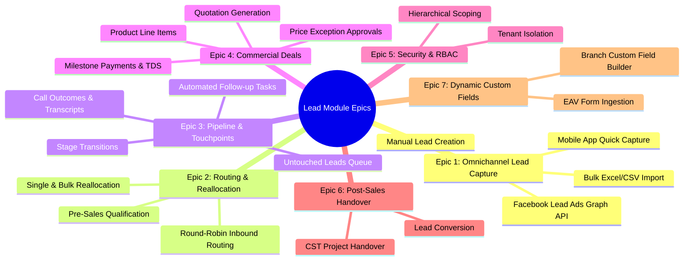

# Lead Module Agile User Story Specification Document
**Platform:** myAgenci.ai CRM  
**Module:** Lead Management & Sales Pipeline  
**Version:** 2.0  
**Target Audience:** Product Managers, Scrum Masters, Tech Leads, QA Engineers & Business Analysts  

---

## 1. Document Overview & Objective

This document defines the comprehensive **Agile User Stories** for the **Lead Module** of `myAgenci.ai CRM`. Each story is structured with user personas, clear business intent (*As a... I want to... So that...*), detailed Acceptance Criteria (Given/When/Then), validation rules, error scenarios, and technical mapping to ensure seamless implementation and test coverage.

---

## 2. User Personas & Role Profiles

| Persona Code | Role Name | System Access Level | Key Objectives |
|---|---|---|---|
| **PER-1** | **Company Admin / Director** | `ACCESS_COMPANY` | Overall business pipeline visibility, approval of high-value discounts, branch performance tracking. |
| **PER-2** | **Branch Manager** | `ACCESS_BRANCH` | Supervising branch leads, managing branch quotas, reallocating leads among team leaders and executives. |
| **PER-3** | **Team Leader (TL) / Sales Manager** | `ACCESS_TEAM` | Daily team target tracking, monitoring untouched leads, auditing agent telecall logs and follow-up reminders. |
| **PER-4** | **Sales Executive / Telecaller** | `ACCESS_SELF` | Contacting assigned leads, logging call updates, negotiating pricing, booking reminders, closing sales. |
| **PER-5** | **Pre-Sales Qualifier** | Branch / Company Scoped | Rapid lead qualification, scrubbing inbound inquiries, routing qualified leads to appropriate branch sales reps. |
| **PER-6** | **Customer Support Executive (CST)** | Support Scoped | Post-sales customer onboarding, project kick-off handover, ticket resolution for converted leads. |

---

## 3. Epics & Story Breakdown

---

## Epic 1: Omnichannel Lead Ingestion & Capture

### US-1.1: Single Manual Lead Creation with Branch Scoping
- **Story ID:** `US-1.1`
- **Epic:** Lead Ingestion
- **Priority:** Must Have (MoSCoW: M)
- **Primary Persona:** `PER-4` (Sales Executive), `PER-3` (Team Leader), `PER-2` (Branch Manager)

#### Narrative:
> **As a** Sales Executive or Manager,  
> **I want to** quickly capture a new lead with company name, contact person, mobile number, branch, and product interest,  
> **So that** the lead is recorded in the CRM and tracked in the sales pipeline without losing inbound prospects.

#### Acceptance Criteria:
- **AC-1.1.1 (Required Fields):** Given I am on the `/leads/create` page, when I submit the form, `Company Name`, `Contact Person`, `Branch`, and `Mobile Number` must be mandatory.
- **AC-1.1.2 (Phone Validation):** The system must enforce international E.164 phone regex `/^\+?[0-9]{7,15}$/`. If invalid characters (letters/symbols) are submitted, an inline error `"Please enter a valid mobile number"` must be displayed.
- **AC-1.1.3 (Auto-Attributes):** When submitted successfully:
  - `created_by` must default to `auth()->id()`.
  - `company_id` must default to `auth()->user()->company_id`.
  - `lead_date` must default to `today()` if not explicitly specified.
- **AC-1.1.4 (Redirection & Feedback):** Upon successful creation, the system must redirect to `/leads/{id}` (Lead Details page) with a green toast notification: `"Lead created successfully"`.

#### Technical Reference:
- Controller: [`LeadController@store`](app/Http/Controllers/LeadController.php)
- Form Request: [`StoreLeadRequest.php`](app/Http/Requests/StoreLeadRequest.php)
- View: [`resources/views/pages/leads/form.blade.php`](resources/views/pages/leads/form.blade.php)

---

### US-1.2: Bulk Lead Ingestion via CSV / Excel
- **Story ID:** `US-1.2`
- **Epic:** Lead Ingestion
- **Priority:** Should Have (MoSCoW: S)
- **Primary Persona:** `PER-1` (Company Admin), `PER-2` (Branch Manager)

#### Narrative:
> **As a** Branch Manager or Administrator,  
> **I want to** upload a `.csv` or `.xlsx` spreadsheet of leads and map its columns to CRM fields,  
> **So that** marketing event attendees and third-party directories can be ingested into the pipeline in bulk without manual entry.

#### Acceptance Criteria:
- **AC-1.2.1 (Upload & Parsing):** Given I am on the bulk import page, when I upload a spreadsheet up to 10MB, the system parses row headers and displays an interactive column mapping interface.
- **AC-1.2.2 (Column Mapping):** The user can map spreadsheet columns to CRM attributes: *Company Name*, *Contact Person*, *Phone Number*, *Email*, *Lead Source*, and *Branch*.
- **AC-1.2.3 (Duplicate Detection):** During ingestion, if a phone number already exists within the current `company_id`, the system must skip or flag the record and record it in an import error summary log.
- **AC-1.2.4 (Atomic Transactions):** Ingestion must execute inside database transactions with batch processing of 100 rows per chunk to avoid timeouts.

#### Technical Reference:
- Controller: [`LeadImportController.php`](app/Http/Controllers/LeadImportController.php)

---

### US-1.3: Real-Time Facebook Lead Ads Graph API Ingestion
- **Story ID:** `US-1.3`
- **Epic:** Lead Ingestion
- **Priority:** Must Have (MoSCoW: M)
- **Primary Persona:** `PER-1` (Company Admin) / Automated System

#### Narrative:
> **As a** Marketing Administrator,  
> **I want** inquiries from Meta Lead Gen Ad campaigns to instantly sync into the CRM via Meta Graph API,  
> **So that** our sales team can contact ad respondents within minutes of ad submission.

#### Acceptance Criteria:
- **AC-1.3.1 (Webhook & Polling Ingestion):** The scheduler `php artisan app:facebook-lead-integration` polls the Graph API `v19.0` for new leads using the configured `campaign_masters` access token.
- **AC-1.3.2 (Payload Extraction):** The service extracts `full_name`, `phone_number`, `email`, and custom form fields from Meta's `field_data` JSON array.
- **AC-1.3.3 (Audit Trail):** The raw JSON payload is archived in `leads.facebook_payload` and `leads.facebook_lead_id` for compliance and debugging.
- **AC-1.3.4 (Automated Routing):** Leads are distributed round-robin among active sales reps specified in the campaign's `assigned_users` configuration.

#### Technical Reference:
- Command: [`FacebookLeadIntegration.php`](app/Console/Commands/FacebookLeadIntegration.php)
- Service: [`FacebookLeadImporter.php`](app/Services/FacebookLeadImporter.php)

---

## Epic 2: Lead Routing & Reallocation

### US-2.1: Pre-Sales Lead Qualification & Assignment
- **Story ID:** `US-2.1`
- **Epic:** Lead Routing
- **Priority:** Should Have (MoSCoW: S)
- **Primary Persona:** `PER-5` (Pre-Sales Qualifier)

#### Narrative:
> **As a** Pre-Sales Qualifier,  
> **I want to** review unassigned inbound leads, verify customer intent and budget, and assign them to an active Sales Executive,  
> **So that** only qualified sales opportunities reach the branch closing team.

#### Acceptance Criteria:
- **AC-2.1.1:** Given a lead has `assigned_to = NULL`, it appears in the Pre-Sales review queue.
- **AC-2.1.2:** The qualifier can assign the lead to a branch executive using a searchable Select2 dropdown of active sales reps.
- **AC-2.1.3:** Once assigned, `leads.assigned_to` and `leads.pre_sale_executive_id` are updated, and the executive receives an instant notification.

---

### US-2.2: Mass / Single Lead Reallocation
- **Story ID:** `US-2.2`
- **Epic:** Lead Routing
- **Priority:** Must Have (MoSCoW: M)
- **Primary Persona:** `PER-2` (Branch Manager), `PER-3` (Team Leader)

#### Narrative:
> **As a** Team Leader or Branch Manager,  
> **I want to** transfer one or more leads from one executive to another (e.g. employee absence, resignation, or workload rebalancing),  
> **So that** leads are not neglected and customer communication continues smoothly.

#### Acceptance Criteria:
- **AC-2.2.1 (Single Reassign):** On the lead profile page, clicking **Reassign** opens a modal where a manager can select a target executive with optional transfer remarks.
- **AC-2.2.2 (Bulk Reassign):** On the main table view (`/leads`), selecting multiple lead checkboxes enables the **Bulk Reassign** action bar.
- **AC-2.2.3 (Permission Gate):** Sales executives (`ACCESS_SELF`) cannot reassign leads. Only Branch Admins and Team Leaders can execute transfers within their assigned scope.

#### Technical Reference:
- Controller: [`LeadReallocationController.php`](app/Http/Controllers/LeadReallocationController.php)

---

## Epic 3: Sales Pipeline & Touchpoint Management

### US-3.1: Untouched Leads Priority Queue
- **Story ID:** `US-3.1`
- **Epic:** Touchpoint Management
- **Priority:** Must Have (MoSCoW: M)
- **Primary Persona:** `PER-3` (Team Leader), `PER-4` (Sales Executive)

#### Narrative:
> **As a** Sales Executive,  
> **I want to** see an isolated queue of leads that have never received a telecall,  
> **So that** I can prioritize fresh inquiries and achieve first contact within the company SLA (&lt; 2 hours).

#### Acceptance Criteria:
- **AC-3.1.1 (Query Filter):** Navigating to `/leads/untouched` lists leads where `COUNT(lead_call_updates) == 0` and `status NOT IN ('won', 'lost', 'cancelled')`.
- **AC-3.1.2 (SLA Aging Badge):** Leads display an aging badge (e.g. `"Received 3 hours ago"` in yellow, `"> 24 hours"` in red).
- **AC-3.1.3 (Auto-Removal):** As soon as an executive logs the first call update against an untouched lead, it is immediately removed from the untouched queue.

#### Technical Reference:
- Controller: `LeadController@untouchedIndex`
- View: [`resources/views/pages/leads/untouched.blade.php`](resources/views/pages/leads/untouched.blade.php)

---

### US-3.2: Logging Telecall Outcomes & Call Transcripts
- **Story ID:** `US-3.2`
- **Epic:** Touchpoint Management
- **Priority:** Must Have (MoSCoW: M)
- **Primary Persona:** `PER-4` (Sales Executive)

#### Narrative:
> **As a** Sales Executive,  
> **I want to** log the outcome and notes of every phone conversation with a prospect,  
> **So that** the lead history is documented and any team member can pick up where I left off.

#### Acceptance Criteria:
- **AC-3.2.1:** From `/leads/{id}`, clicking **Log Call** opens a modal with:
  - `Outcome` (e.g., *Connected*, *Not Reachable*, *Ringing No Response*, *Busy*, *Wrong Number*).
  - `Outcome Subcategory` (e.g., *Price High*, *Looking for Alternate Service*, *Call Back Later*).
  - `Notes / Discussion Summary` (Text).
  - `Next Follow-Up Date` & `Time` (Optional/Conditional).
- **AC-3.2.2 (Historical Audit):** The saved record is appended to the lead's Call History timeline chronologically showing caller name, timestamp, outcome badge, and notes.

#### Technical Reference:
- Controller: [`LeadShowController@storeCall`](app/Http/Controllers/LeadShowController.php)
- Model: [`App\Models\LeadCallUpdate`](app/Models/LeadCallUpdate.php)

---

### US-3.3: Automated Follow-Up Task Generation & Reminders
- **Story ID:** `US-3.3`
- **Epic:** Touchpoint Management
- **Priority:** Must Have (MoSCoW: M)
- **Primary Persona:** `PER-4` (Sales Executive)

#### Narrative:
> **As a** Sales Executive,  
> **I want** the system to automatically generate a scheduled reminder task whenever I schedule a future follow-up during a call log,  
> **So that** I never forget to call a client back at the agreed-upon date and time.

#### Acceptance Criteria:
- **AC-3.3.1 (Auto-Creation):** If `next_follow_up` date is entered in the Call Update modal, a new record in `lead_reminders` is automatically created with `is_completed = 0`.
- **AC-3.3.2 (Dashboard Alert):** On the day the reminder is due, it appears in the executive's Daily Task List and notification dropdown.
- **AC-3.3.3 (Completion):** When the executive logs the subsequent call or checks the reminder checkbox, `is_completed` is set to `1` and `completed_at` is timestamped.

#### Technical Reference:
- Model: [`App\Models\LeadReminder`](app/Models/LeadReminder.php)

---

## Epic 4: Commercial Deals, Pricing & Milestone Payments

### US-4.1: Adding Multiple Product / Service Line Items
- **Story ID:** `US-4.1`
- **Epic:** Commercial Deals
- **Priority:** Must Have (MoSCoW: M)
- **Primary Persona:** `PER-4` (Sales Executive)

#### Narrative:
> **As a** Sales Executive,  
> **I want to** associate multiple products/services to a single lead with custom unit prices, quantities, discount percentages, and GST,  
> **So that** comprehensive multi-service proposals can be created and tracked.

#### Acceptance Criteria:
- **AC-4.1.1:** An executive can add line items selecting products from the master catalog.
- **AC-4.1.2 (Calculations):** The system calculates:
  - Subtotal = Unit Price * Quantity
  - Discount Amount = Subtotal * (Discount % / 100)
  - Taxable Value = Subtotal - Discount Amount
  - GST Amount = Taxable Value * (GST % / 100)
  - Net Total = Taxable Value + GST Amount
- **AC-4.1.3:** Changes to line items dynamically update the parent lead's cumulative `deal_value`.

#### Technical Reference:
- Controller: [`LeadShowController@storeProduct`](app/Http/Controllers/LeadShowController.php)
- Model: [`App\Models\LeadProduct`](app/Models/LeadProduct.php)

---

### US-4.2: Discount & Below-Base Price Exception Workflow
- **Story ID:** `US-4.2`
- **Epic:** Commercial Deals
- **Priority:** Should Have (MoSCoW: S)
- **Primary Persona:** `PER-4` (Sales Executive), `PER-1` (Company Admin / Sales Head)

#### Narrative:
> **As a** Sales Executive offering a steep discount below product minimum threshold,  
> **I want to** submit a Price Approval Request to my manager,  
> **So that** special pricing can be approved without breaking corporate profitability guidelines.

#### Acceptance Criteria:
- **AC-4.2.1:** If requested price is below base unit price, a **Request Price Approval** button is shown.
- **AC-4.2.2:** Submitting creates a record in `lead_product_price_requests` with status `pending`.
- **AC-4.2.3 (Manager Action):** Authorized managers receive a pending badge and can **Approve** or **Reject** with comments via web or mobile API (`/api/leads/price-requests/{id}/approve`).
- **AC-4.2.4 (Auto Update):** Upon approval, `lead_products.unit_price` is updated to the approved rate and totals are recalculated.

---

### US-4.3: Milestone Payments Collection & TDS Accounting
- **Story ID:** `US-4.3`
- **Epic:** Commercial Deals
- **Priority:** Must Have (MoSCoW: M)
- **Primary Persona:** `PER-4` (Sales Executive), Accounts Team

#### Narrative:
> **As an** Executive collecting advance or milestone payments,  
> **I want to** log client payments with mode (NEFT, UPI, Cheque), reference UTR, receipt attachments, and TDS deduction details,  
> **So that** commercial accounts and outstanding balances match our bank statements.

#### Acceptance Criteria:
- **AC-4.3.1:** From any lead product line item, users can click **Add Payment**.
- **AC-4.3.2 (TDS Calculation):** If client withholds TDS (e.g. 2% or 10% under Section 194J/194C):
  - TDS Amount = Gross Amount * (TDS % / 100)
  - Net Credited Amount = Gross Amount - TDS Amount
- **AC-4.3.3 (Balance Tracking):** The product's `amount_paid` updates automatically. If `amount_paid >= total_price`, `payment_status` flips from `partial` to `paid`.

#### Technical Reference:
- Controller: `LeadShowController@storeProductPayment`
- Model: [`App\Models\LeadProductPayment`](app/Models/LeadProductPayment.php)

---

## Epic 5: Enterprise Security & Hierarchical RBAC

### US-5.1: Tenant Isolation via `BelongsToCompany`
- **Story ID:** `US-5.1`
- **Epic:** Security & RBAC
- **Priority:** Must Have (MoSCoW: M)
- **Primary Persona:** All Users / System Security

#### Narrative:
> **As an** Enterprise Customer,  
> **I want** strict data boundary isolation between different companies,  
> **So that** users from Company A can never view, search, or alter leads belonging to Company B.

#### Acceptance Criteria:
- **AC-5.1.1:** Every query to `leads` automatically enforces `company_id = auth()->user()->company_id` via global scopes or `DataVisibilityService`.
- **AC-5.1.2:** Manual URL parameter tampering (e.g. navigating to `/leads/999` where lead 999 belongs to another tenant) returns HTTP 403 Forbidden or 404 Not Found.

---

### US-5.2: Hierarchical Data Visibility Scoping
- **Story ID:** `US-5.2`
- **Epic:** Security & RBAC
- **Priority:** Must Have (MoSCoW: M)
- **Primary Persona:** `PER-1` (Admin), `PER-2` (Branch Manager), `PER-3` (TL), `PER-4` (Executive)

#### Narrative:
> **As a** Sales Operations Manager,  
> **I want** lead visibility scoped strictly based on organizational hierarchy,  
> **So that** sales reps focus only on their assigned leads while managers inspect their branch or team.

#### Acceptance Criteria:
- **AC-5.2.1:** Telecallers/Executives can only view leads where `assigned_to = auth()->id()` or `created_by = auth()->id()`.
- **AC-5.2.2:** Team Leaders can view leads assigned to themselves and subordinates mapped in `user_mappings`.
- **AC-5.2.3:** Branch Managers can view leads within their authorized branch list (`user_branches`).
- **AC-5.2.4:** All list queries, export queries, and AJAX search endpoints route through `app(DataVisibilityService::class)->applyLeadVisibility($query)`.

#### Technical Reference:
- Service: [`App\Services\DataVisibilityService`](app/Services/DataVisibilityService.php)

---

## Epic 6: Post-Sales Conversion & Customer Support Handover

### US-6.1: Lead Conversion to Won / Client
- **Story ID:** `US-6.1`
- **Epic:** Post-Sales Handover
- **Priority:** Must Have (MoSCoW: M)
- **Primary Persona:** `PER-4` (Sales Executive), `PER-3` (Team Leader)

#### Narrative:
> **As a** Sales Executive closing a deal,  
> **I want to** mark a lead as "Won / Converted",  
> **So that** the prospect graduates into the active client directory and triggers post-sales workflows.

#### Acceptance Criteria:
- **AC-6.1.1:** When lead status is changed to `Won` (or status ID in `[5, 15]`), the lead `closure_date` and `converted_at` are timestamped.
- **AC-6.1.2:** The lead appears under converted reports and sales incentives are tallied.
- **AC-6.1.3:** An allocation prompt opens to assign a Customer Support Team Leader (CST TL) and CST Executive for delivery.

---

### US-6.2: Customer Support Team (CST) Allocation & Kick-off
- **Story ID:** `US-6.2`
- **Epic:** Post-Sales Handover
- **Priority:** Should Have (MoSCoW: S)
- **Primary Persona:** `PER-6` (CST Executive)

#### Narrative:
> **As a** Customer Support Executive,  
> **I want to** access converted lead briefs, review promised deliverables, and log post-sales kick-off notes,  
> **So that** project fulfillment proceeds smoothly without losing context from the sales discovery.

#### Acceptance Criteria:
- **AC-6.2.1:** Converted leads with CST allocations appear on the CST Dashboard.
- **AC-6.2.2:** CST team members can log onboarding notes via `/leads/{id}/cst-updates` (`lead_cst_updates`).
- **AC-6.2.3:** Files uploaded by the client during discovery (e.g. logos, requirement briefs) are viewable under the **Lead Documents** tab.

---

## Epic 7: Dynamic Custom Fields (Custom Form Builder)

### US-7.1: Configuring Custom Attributes per Branch/Tenant
- **Story ID:** `US-7.1`
- **Epic:** Dynamic Custom Fields
- **Priority:** Could Have (MoSCoW: C)
- **Primary Persona:** `PER-1` (Company Admin)

#### Narrative:
> **As a** Tenant Administrator,  
> **I want to** create custom fields (Text, Number, Date, Dropdown, File) for specific branches without database migrations,  
> **So that** unique industry-specific lead data (e.g., GSTIN, PAN, Turnover, Fleet Size) can be collected.

#### Acceptance Criteria:
- **AC-7.1.1:** Admin can navigate to `/leads/form-fields` and define new attributes with type, label, and options JSON.
- **AC-7.1.2:** When creating/editing a lead in that branch, custom fields are rendered dynamically.
- **AC-7.1.3:** Submissions are validated according to the field configuration and saved to `lead_field_values` (EAV pattern).

#### Technical Reference:
- Controller: [`LeadFormFieldController.php`](app/Http/Controllers/LeadFormFieldController.php)
- Models: [`LeadFormField`](app/Models/LeadFormField.php) & [`LeadFieldValue`](app/Models/LeadFieldValue.php)

---

## 4. Definition of Done (DoD) Checklist

For every user story implemented in the Lead Module:
- [ ] **Code Quality:** Written in PSR-12 standard; business logic kept inside Services/Models rather than bloated controllers.
- [ ] **Data Scoping:** Enforced via `DataVisibilityService::applyLeadVisibility($query)` and `BelongsToCompany`.
- [ ] **Input Validation:** Enforces Form Requests with regex sanitization (phone numbers, currency formats).
- [ ] **Auditability:** Timestamps, `created_by`, and soft-deletes (`deleted_at`) properly populated.
- [ ] **UI/UX Consistency:** Select2 dropdowns correctly configured with AJAX lazy-loading and collision guards (`data-no-select2`).
- [ ] **Mobile Parity:** Mobile endpoints updated under `/api/leads` and tested with Sanctum tokens.
- [ ] **Automated Testing:** Unit/Feature tests covering the acceptance criteria.

---

## 5. Traceability Matrix

| Story ID | Story Title | Priority | Core Controller / Service | Primary Model |
|---|---|---|---|---|
| `US-1.1` | Single Manual Lead Creation | Must Have | `LeadController@store` | `Lead` |
| `US-1.2` | Bulk Excel/CSV Lead Ingestion | Should Have | `LeadImportController` | `Lead` |
| `US-1.3` | Facebook Graph API Auto-Sync | Must Have | `FacebookLeadImporter` | `Lead` |
| `US-2.1` | Pre-Sales Lead Qualification | Should Have | `LeadController@update` | `Lead` |
| `US-2.2` | Single / Mass Reallocation | Must Have | `LeadReallocationController` | `Lead` |
| `US-3.1` | Untouched Leads Queue | Must Have | `LeadController@untouchedIndex` | `Lead` |
| `US-3.2` | Telecall Interaction Logging | Must Have | `LeadShowController@storeCall` | `LeadCallUpdate` |
| `US-3.3` | Auto-Scheduled Follow-up Tasks | Must Have | `LeadShowController@storeCall` | `LeadReminder` |
| `US-4.1` | Multiple Product Line Items | Must Have | `LeadShowController@storeProduct` | `LeadProduct` |
| `US-4.2` | Price Exception Approval | Should Have | `LeadProductPriceRequestController` | `LeadProductPriceRequest`|
| `US-4.3` | Milestone Payments & TDS | Must Have | `LeadShowController@storeProductPayment` | `LeadProductPayment` |
| `US-5.1` | Multi-Tenant Data Isolation | Must Have | `BelongsToCompany` trait | `Lead` |
| `US-5.2` | Hierarchical Data Visibility | Must Have | `DataVisibilityService` | `Lead` |
| `US-6.1` | Lead Conversion to Won / Client | Must Have | `LeadController@updateStatus` | `Lead` |
| `US-6.2` | CST Onboarding & Handover | Should Have | `LeadController@storeCstUpdate` | `LeadCstUpdate` |
| `US-7.1` | Dynamic Custom Form Builder | Could Have | `LeadFormFieldController` | `LeadFormField` |
