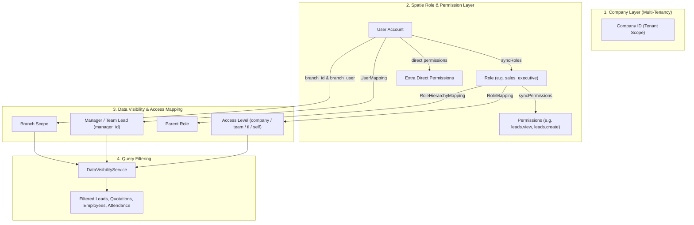
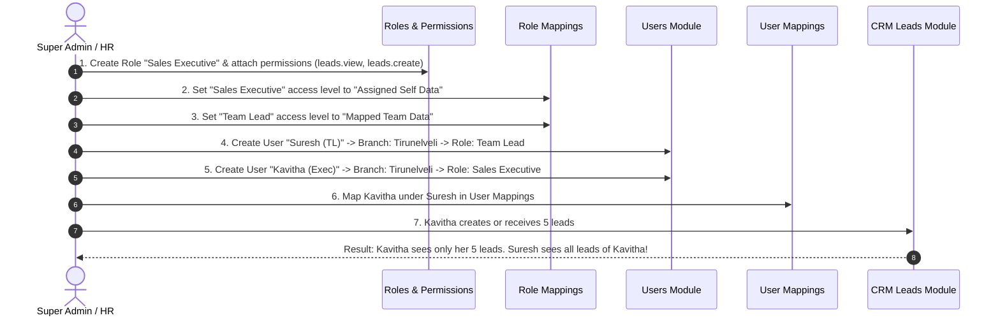

# Roles, Permissions & User Mapping Module Documentation

> **Application:** MyAgency / STS Agency CRM & HRMS  
> **Framework:** Laravel (PHP 8.2+)  
> **Key Packages:** Spatie Laravel-Permission, Multi-Company Tenancy, Custom Data Visibility Service  
> **Generated Date:** October 2026  
> **Location:** `docs/ROLES_PERMISSIONS_AND_USER_MAPPING_DOCUMENTATION.md`

---

## 1. Overview & Architecture

The application implements a multi-tier Authorization and Data Visibility Architecture:



### Key Differences:
1. **Roles & Permissions (Spatie):** Determines **WHAT ACTIONS** a user can perform (e.g., Can this user click "Delete Lead"? Can this user access "Employee Onboarding"?).
2. **Access Mapping (`role_mappings`):** Determines **WHAT SCOPE OF DATA** a role can access (`company`, `team`, `tl`, `self`).
3. **User Mapping (`user_mappings`):** Determines **WHO REPORTS TO WHOM** (Organizational Hierarchy / Team Lead to Executives).
4. **Branch Mapping (`branch_id` + `branch_user`):** Determines **WHICH BRANCH(ES)** the user belongs to.

---

## 2. Database Schema & Tables

| Table Name | Model | Purpose |
|---|---|---|
| `users` | `App\Models\User` | Main user credentials, primary `branch_id`, `company_id`, `is_active`. |
| `branch_user` | Pivot Table | Multi-branch assignments for a user (`user_id`, `branch_id`). |
| `roles` | `App\Models\Role` | Roles scoped by `company_id` using tenant-prefixed names (`name`, `display_name`, `department_id`). |
| `permissions` | `App\Models\Permission` | Granular action permissions grouped by `module`. |
| `model_has_roles` | Spatie Pivot | Maps `user_id` to `role_id`. |
| `role_has_permissions` | Spatie Pivot | Maps `role_id` to `permission_id`. |
| `model_has_permissions` | Spatie Pivot | Direct extra permissions assigned to specific users. |
| `role_mappings` | `App\Models\RoleMapping` | Defines access scope (`company`, `team`, `tl`, `self`) for each role. |
| `role_hierarchy_mappings` | `App\Models\RoleHierarchyMapping` | Role parent-child relationship (`parent_role_id`, `child_role_id`). |
| `user_mappings` | `App\Models\UserMapping` | Reporting manager relationship (`manager_id`, `user_id`, `company_id`). |
| `employee_onboardings` | `App\Models\EmployeeOnboarding` | HR employee profile linked to `users.id` via `portal_user_id`. |

---

## 3. How to Create a User

There are two primary ways to create users in the application:
1. Through the **User Management Module** (`/users`).
2. Through the **Employee Onboarding Module** (`/employee-onboarding`).
3. Programmatically via **Backend / Tinker / Seeder**.

---

### Method A: Via User Management UI (`/users/create`)

#### Step-by-Step UI Process:
1. Log in with **Admin** / **Super Admin** or a user having `users.manage` permission.
2. Navigate to **Users** in the sidebar menu or URL: `http://<your-domain>/users`.
3. Click the **"Add User"** button in the top right corner.
4. Fill out the form fields:
   - **Full Name:** User's display name.
   - **Email Address:** Work login email (must be unique).
   - **Password & Confirm Password:** Minimum 8 characters.
   - **Phone / Designation:** Contact phone number or designation.
   - **Primary Branch (`branch_id`):** The primary branch this user belongs to.
   - **Additional Branches (`branches[]`):** Optional checkboxes if the user manages or works across multiple branches (stored in `branch_user`).
   - **Role:** Select the initial role for this user (e.g., `Tele Caller`, `Sales Executive`, `Branch Admin`).
   - **Status:** Active / Inactive toggle.
   - **Profile Photo / Avatar:** Optional image upload.
5. Click **"Save User"**.

#### Under the Hood (`UserController::store`):
```php
// 1. Checks company user limit
if ($company && $company->activeUsers()->count() >= $company->user_limit) {
    return redirect()->back()->with('error', 'User limit reached.');
}

// 2. Creates the User record
$user = User::create([
    'name'        => $data['name'],
    'email'       => $data['email'],
    'password'    => Hash::make($data['password']),
    'company_id'  => auth()->user()?->company_id,
    'branch_id'   => $data['branch_id'],
    'phone'       => $data['phone'],
    'is_active'   => true,
]);

// 3. Multi-branch pivot mapping
$user->branches()->sync($selectedBranches);

// 4. Assign Spatie Role
$user->syncRoles([$role]);
app(PermissionRegistrar::class)->forgetCachedPermissions();
```

---

### Method B: Via Employee Onboarding (`/employee-onboarding/create`)

When HR onboards an employee, the system automatically creates their portal account and configures their reporting manager!

#### Step-by-Step UI Process:
1. Navigate to **HRMS > Employee Onboarding > Add Employee**.
2. In **Step 1 / Account Details**:
   - Fill in **Name**, **Email**, and **Branch**.
   - Fill in **Portal Login Email** and **Portal Login Password**.
   - Select **Department** and **Role**.
   - Select **Reporting Manager / Team Lead (TL)** in the dropdown.
3. When saved, the controller (`EmployeeOnboardingController`):
   - Creates the `User` record with `branch_id` set to the selected branch.
   - Links `employee_onboardings.portal_user_id = $portalUser->id`.
   - Generates `employee_id` with the branch prefix (e.g. `CHE0001`, `MDU0001`).
   - Automatically maps the User to their Team Lead in `user_mappings`:
     ```php
     UserMapping::updateOrCreate(
         ['user_id' => $portalUser->id],
         [
             'manager_id' => $validated['tl_user_id'],
             'company_id' => $portalUser->company_id,
         ]
     );
     ```

---

### Method C: Creating a User via Backend / Code

If you create a user in a migration, seeder, tinker, or custom backend service, **YOU MUST** set all required associations so that filtering and scopes work properly:

```php
use App\Models\User;
use App\Models\Role;
use App\Models\UserMapping;
use Illuminate\Support\Facades\Hash;
use Spatie\Permission\PermissionRegistrar;

$companyId = 1; // Company ID
$branchId  = 2; // Branch ID (e.g. Chennai)

// 1. Create User
$user = User::create([
    'name'       => 'Ramesh Kumar',
    'email'      => 'ramesh@agency.com',
    'password'   => Hash::make('Secret@123'),
    'company_id' => $companyId,
    'branch_id'  => $branchId,  // VERY IMPORTANT for branch filtering!
    'is_active'  => true,
]);

// 2. Attach branch to pivot table (if multi-branch or for scope queries)
$user->branches()->sync([$branchId]);

// 3. Assign Tenant Role
$tenantRoleName = Role::tenantRoleName('sales_executive', $companyId);
$role = Role::where('name', $tenantRoleName)->first();
if ($role) {
    $user->syncRoles([$role]);
}

// 4. Map to Reporting Manager (Team Lead)
$teamLeadUserId = 5; // ID of the Team Lead user
UserMapping::updateOrCreate(
    ['user_id' => $user->id],
    [
        'manager_id' => $teamLeadUserId,
        'company_id' => $companyId,
    ]
);

// 5. Clear Spatie Cache
app(PermissionRegistrar::class)->forgetCachedPermissions();
```

---

## 4. Roles Management

### What is a Role?
A Role is a collection of permissions that define what actions a user can take. Roles in this application are multi-tenant and prefixed with the company identifier (e.g., `company_1__sales_executive` or `super_admin`).

### How to Create a Role (`/roles/create`)
1. Go to **Settings > Roles** (`/roles`).
2. Click **"Create Role"** (`/roles/create`).
3. Fill in:
   - **Role Key / Name:** Machine-friendly name (e.g., `tele_caller`, `bde`, `production_manager`).
   - **Display Name:** Human-readable name (e.g., `Telecaller`, `Business Development Executive`).
   - **Department:** Select which department this role belongs to (e.g., Sales, Production, HR).
   - **Description:** Optional notes about the role's responsibilities.
   - **Assign Permissions:** You can check the initial permissions for this role right on the creation form.
4. Click **"Save Role"**.

#### Multi-Tenant Role Naming Logic:
```php
// In Role::tenantRoleName($name, $companyId)
// Translates simple name "telecaller" into tenant-scoped "company_{id}__telecaller"
$roleName = Role::tenantRoleName($data['name'], $companyId);
```

---

## 5. Adding & Editing Permissions for Roles

Permissions define granular access (e.g., `leads.create`, `leads.view`, `leads.delete`, `users.manage`, `hrms.attendance.view`).

### Step-by-Step UI Guide to Add Permissions to a Role:
1. Navigate to **Roles** (`/roles`).
2. Find the Role you want to modify (e.g., `Tele Caller`).
3. Click the **"Permissions"** icon / button (Route: `/roles/{role}/permissions`).
4. You will see permissions grouped by module:
   - **Leads:** `leads.view`, `leads.create`, `leads.edit`, `leads.delete`, `leads.assign`, `leads.export`.
   - **Users:** `users.view`, `users.manage`.
   - **Roles & Permissions:** `roles.view`, `roles.manage`, `permissions.view`, `permissions.manage`.
   - **HRMS & Attendance:** `hrms.view`, `hrms.attendance.view`, `hrms.leave.approve`.
   - **Production:** `production.view`, `production.assign`, `production.update`.
   - **Expenses & Finance:** `expenses.view`, `expenses.create`, `expenses.approve`.
5. Check / uncheck the permissions you want this role to have.
6. Click **"Update Permissions"** at the bottom of the page.

#### Behind the Scenes (`RolePermissionController::rolesPermissionsUpdate`):
```php
$role->syncPermissions($data['permissions'] ?? []);
app(\Spatie\Permission\PermissionRegistrar::class)->forgetCachedPermissions();
```

---

### Assigning Direct Extra Permissions to a Specific User

Sometimes, an individual employee needs an extra permission that their base role does not have (or an exemption).

1. Go to **Users** (`/users`).
2. Click on the user's name or **"View"** (`/users/{user}`).
3. Open the **"Assign Role & Permissions"** section or modal.
4. In the **Direct Permissions** checklist, check the additional permissions.
5. Save. This calls `/users/{user}/assign-role`, updating Spatie's `model_has_permissions` table.

---

## 6. User Mapping (Reporting Hierarchy)

### Why is User Mapping Important?
User Mapping defines **who reports to whom** in the company.  
For example:
- **Sales Head** (Manager of TLs)
  - ↳ **Team Lead 1**
    - ↳ **Executive A**
    - ↳ **Executive B**
  - ↳ **Team Lead 2**
    - ↳ **Executive C**

Without User Mapping, a Team Lead with `team` access level will **not be able to see their team members' leads or attendance!**

---

### Configuring User Mapping via UI (`/user-mappings`)

Navigate to **Auth Menu > User Mappings** (`/user-mappings`).

#### Method 1: Hierarchy Tree Builder (Recommended)
1. In the User Mappings screen, you will see a list or chart of all active users.
2. Next to each user, select their **Reporting Manager** from the dropdown.
   - Example: For `Executive A`, select `Team Lead 1`.
   - For `Team Lead 1`, select `Sales Head`.
   - For `Sales Head`, leave empty or select `Company Admin / Super Admin`.
3. The system has built-in **Cycle Detection (`userHierarchyWouldLoop`)**:
   - If User A reports to User B, you cannot set User B to report to User A. The system will throw an alert preventing infinite loops.
4. Click **"Save Hierarchy"**.

#### Method 2: Checklist Mode (By Manager)
1. Select a Manager from the top dropdown (`manager_id`).
2. The page reloads showing checkboxes of all users.
3. Check the checkboxes for all executives who report directly to this manager.
4. Click **"Save Mappings"**.
   - Any unchecked users previously assigned to this manager will be removed.
   - All checked users will be mapped to this manager in `user_mappings`.

---

## 7. Role Mapping & Data Visibility Levels

In addition to Spatie permissions, this CRM uses **Data Visibility Levels** configured in `/role-mappings`.

| Access Level | Key | Description | Who should have this? |
|---|---|---|---|
| **Company All Data** | `company` | Can view all records across all branches and users in the company. | Super Admin, Company Admin, Directors, COO, CBO. |
| **Mapped Team Data** | `team` | Can view own data **PLUS** all records of subordinates mapped under them in `user_mappings` (recursive tree). | Team Leads, Department Managers, Branch Managers. |
| **Mapped TL Data** | `tl` | Can view own data **PLUS** records of direct reports only (one level down). | Assistant TLs, Project Coordinators. |
| **Assigned Self Data** | `self` | Can **ONLY** view records assigned to or created by themselves. | Telecallers, Sales Executives, Designers, Developers. |

### How to Configure Role Mappings (`/role-mappings`):
1. Navigate to **Auth Menu > Role Mappings** (`/role-mappings`).
2. You will see a table with all roles.
3. For each role, set:
   - **Access Level:** Choose from `Company All Data`, `Mapped Team Data`, `Mapped TL Data`, or `Assigned Self Data`.
   - **Parent Role:** Set the hierarchical parent role (e.g. Sales Executive's parent role is Team Lead).
4. Click **"Save Role Mappings"**.

---

## 8. End-to-End Walkthrough: Creating a New Team from Scratch

Suppose you are onboarding a new **"Tirunelveli Sales Team"**:



---

## 9. Common Issues & Troubleshooting

### Issue 1: "User created in backend is not appearing under branch filter"
* **Cause:** `employee_onboardings` does not have a `branch_id` column. Branch filtering relies on `users.branch_id` (via `portal_user_id`) or `employee_id LIKE 'BRANCH_CODE%'`.
* **Fix:** When creating via backend, ensure `users.branch_id` is populated with the correct branch ID and `users.branches()->sync([$branchId])` is called.

### Issue 2: "User added a new permission to a role, but the user cannot access the page"
* **Cause:** Spatie caches permissions in Redis / application memory.
* **Fix:** Clear permission cache by running:
  ```bash
  php artisan permission:cache-reset
  # OR
  php artisan cache:clear
  ```

### Issue 3: "Team Lead cannot see leads created by their team members"
* **Cause 1:** The Team Lead's role in `/role-mappings` is set to `self` instead of `team`.
* **Cause 2:** The team members are not mapped under the Team Lead in `/user-mappings`.
* **Fix:** 
  1. Open `/role-mappings` and ensure the Team Lead role has Access Level = **Mapped Team Data**.
  2. Open `/user-mappings` and ensure the executives have the Team Lead selected as their **Reporting Manager**.

### Issue 4: "User limit reached for this company"
* **Cause:** The company has an active user limit configured in `companies.user_limit`.
* **Fix:** Check current active users count vs limit in `companies` table. Increase `user_limit` for that company or deactivate inactive users.

---

## 10. Quick Artisan Reference Commands

```bash
# Clear permission cache
php artisan permission:cache-reset

# View routes related to roles and users
php artisan route:list --name=roles
php artisan route:list --name=users
php artisan route:list --name=mappings

# Clear config and application cache
php artisan optimize:clear
```
